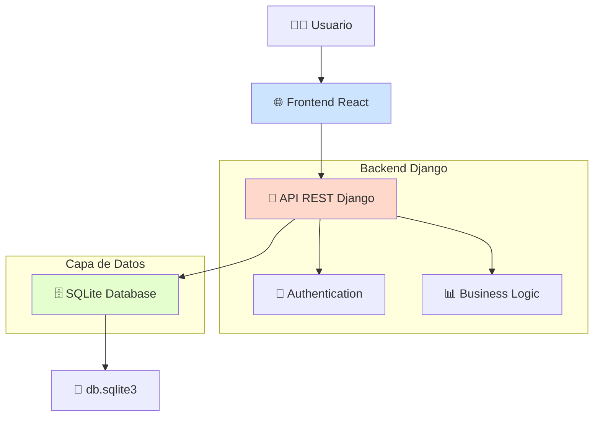
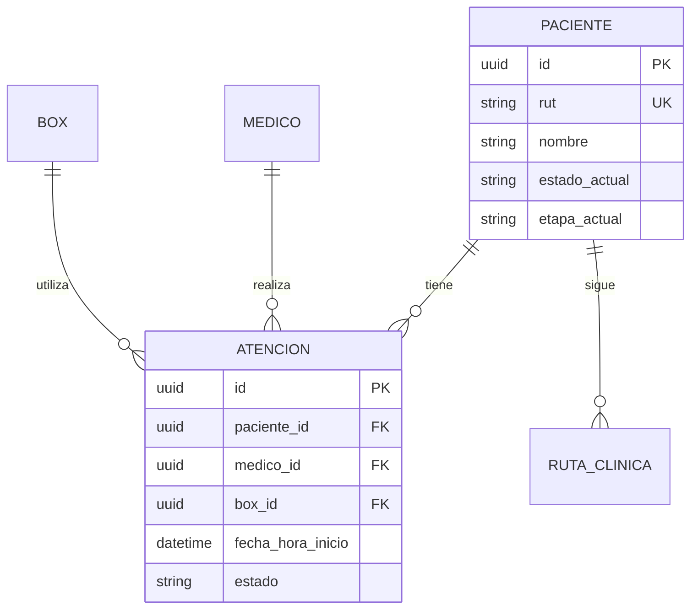
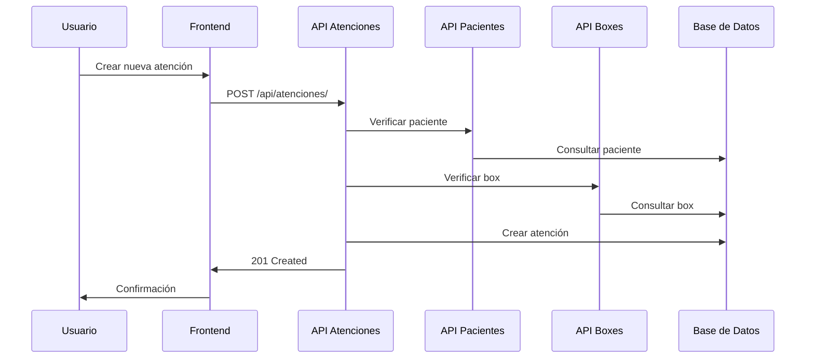
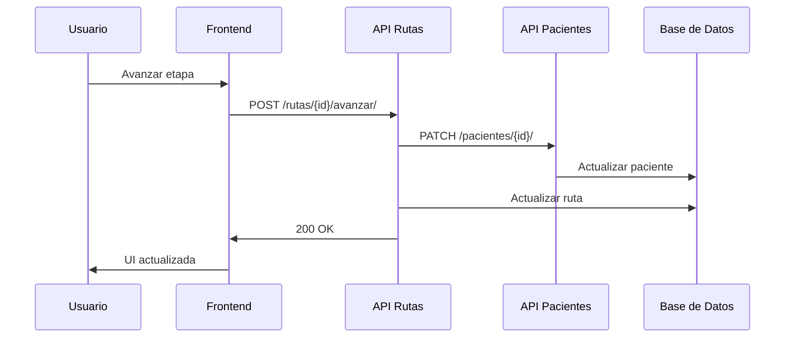

# 🏗️ Arquitectura del Sistema - Nexalud

<div align="center">

[🏠 Inicio](README.md) | 
[👈 Anterior: Instalación](installation.md) | 

</div>

## 📋 Tabla de Contenidos

- [📐 Visión General](#visión-general)
- [🏛️ Patrón Arquitectónico](#patrón-arquitectónico)
- [🗄️ Capa de Datos](#capa-de-datos)

# 📐 Visión General

Nexalud es un sistema de gestión hospitalaria construido con **Django REST Framework** en el backend y **React** en el frontend, utilizando **SQLite** para desarrollo y pruebas.

## Diagrama de Arquitectura



# 🏛️ Patrón Arquitectónico

Arquitectura en Capas

📁 Nexalud/

├── 🎨 Frontend (Presentación)

│   └── React SPA + Material-UI

├── 🔄 Backend (Lógica de Negocio)

│   └── Django REST API

├── 🗄️ Persistencia (Datos)

│   └── SQLite + Django ORM

└── 🔐 Seguridad

    └── JWT + CORS + Permisos


## Principios de Diseño

- Separación de Concerns: Frontend y backend completamente independientes
- API-First: Backend como servicio reusable
- Stateless: Autenticación JWT sin estado
- RESTful: APIs siguiendo convenciones REST

# 🗄️ Capa de Datos

Base de Datos - SQLite (Desarrollo)

Configuración Actual:
python

```bash
# backend/config/settings.py

DATABASES = {
    'default': {
        'ENGINE': 'django.db.backends.sqlite3',
        'NAME': BASE_DIR / 'db.sqlite3',  # Archivo único
    }
}
```

## Ventajas para Desarrollo:

- Configuración cero: No requiere servidor externo
- Portable: Todo en un archivo, fácil de versionar
- Rápido: Ideal para desarrollo y pruebas
- Compatibilidad: Mismo ORM que PostgreSQL

## Diagrama de Entidad Relacional



## Diagrama de Secuencia - Creacion atencion medica



## Diagrama de Secuencia - Sincronización de rutas clínicas



## Diagrama de Capas

```mermaid
graph TB
    subgraph "Capa de Presentación"
        A[React SPA]
        B[Material-UI]
    end
    
    subgraph "Capa de Aplicación"
        C[Django REST API]
        D[Serializers]
        E[ViewSets]
    end
    
    subgraph "Capa de Dominio"
        F[Models]
        G[Business Logic]
    end
    
    subgraph "Capa de Persistencia"
        H[SQLite]
        I[Django ORM]
    end
    
    A --> C
    C --> F
    F --> H
    B --> A
    D --> C
    E --> C
    G --> F
    I --> H


